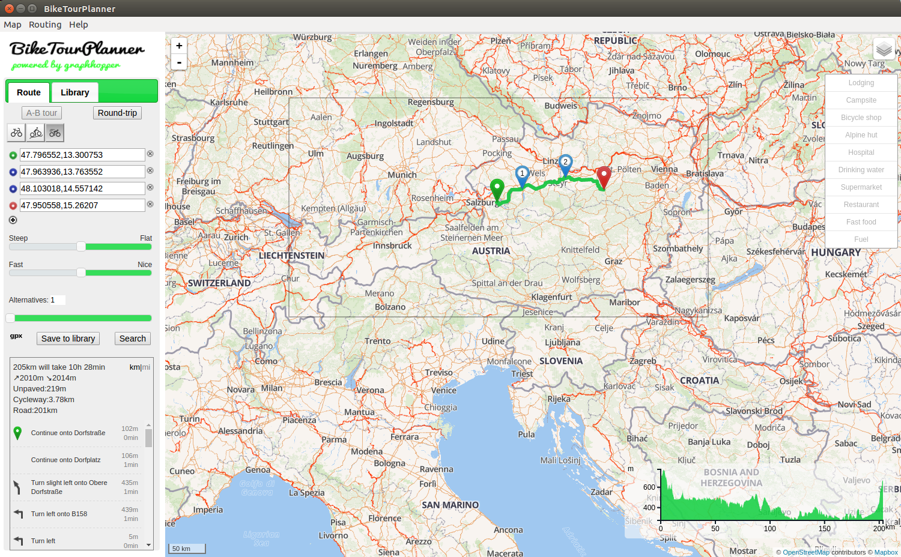

# BikeTourPlanner

BikeTourPlanner is an open source [nw](http://docs.nwjs.io/en/latest/) desktop application for offline planning of bicycle tours based on the [GraphHopper](https://github.com/graphhopper/graphhopper) routing engine. 
It allows the user to generate the routing data from [OpenStreetMap](http://www.openstreetmap.org/about) (OSM) data.
The offline maps are provided by [OSM2VectorTiles](http://osm2vectortiles.org/about) and displayed using [Leaflet](https://github.com/mapbox/mapbox-gl-js) and [mapbox-gl-js](https://github.com/mapbox/mapbox-gl-js). 
BikeTourPlanner comes with an integrated local vector tile map server which uses [nodejs](https://nodejs.org/en/). 
BikeTourPlanner requires an installed Java 8 runtime.
The currently supported platforms are Linux and Microsoft Windows.

The look and feel is similar to [GraphHopper Maps](https://graphhopper.com/maps) as most parts are identical. Here is a screen-shot of the main window:

BikeTourPlanner comes with the map and OSM data of Liechtenstein. 
The map features and the routing features are completely separated. 
This means changing a region requires the user to switch the map in one step and in a second step to seperatly switch the covered routing area. 
The reason is that the data comes from two separated sources.

## Map features
* Integrated download possibility for the installation of OSM2VectorTiles map extracts. 
* Rendering of OSM bicycle routes relations in four different colors, which are derived from the OSM `network` tag. Unpaved way segments show up as a dotted line.
* Bicycle specific point of interests:
  * Logging with the possibility to show up OSM features
  * Campsites with the possibility to show up OSM features
  * Bicycle shops with the possibility to show up OSM features
  * Alpine huts with the possibility to show up OSM features
  * Hospitals with the possibility to show up OSM features
  * Drinking water
  * Supermarkets
  * Restaurants
  * Fast food
  * Fuel
* Display of smoothed elevation profile
* The usage of a map containing the whole planet is possible. Its size currently (2016) is about 56GB. Please do not try to download the whole planet via the menu, but rather use a web browser for downloading it.

## Routing features
* Routing profiles are switchable between bicycle types commuting, mountainbike and racebike
* OSM file download from [GeoFabric](http://download.geofabrik.de) can be started from the menu
* Switching between regions automatically deletes the previous routing data and calculates it anew after the selection of the new OSM extract
* Calculation of routing data from *.pbf or *.osm OSM files. The duration for the calculation depends on the size of the OSM file. Please note that calculation of the routing data is time consuming. 
* The region size which can be handled mainly depends on the RAM. 8 GB RAM are currently sufficient to cover the whole DACH area (Germany, Switzerland, Austria). For a German Bundesland 4 GB RAM should be sufficient.
* Automatic download of elevation data during route data calculation. This data is cached locally. This process requires internet connectivity in case that the cache does not contain the region. This data might become pretty big.
* Route from A to B with optional stopover points
* Round-trips from a starting point with a targeted distance and optional heading
* Display of the distance spent on way classifications
* Display of guessed ascend. Please note that the calculated value might be quite inaccurate!
* Tuning between fast or nice routes
* Routing takes elevation data into account. Tuning between steep or flat routes is possible for all the bicycle types
* Alternative routes calculation
* GPX export
* Storing of tours and modification of stored tours

## Bugs
Please report bugs on [https://github.com/ratrun/biketourplanner](https://github.com/ratrun/biketourplanner/issues)

## Developer information
Todo
